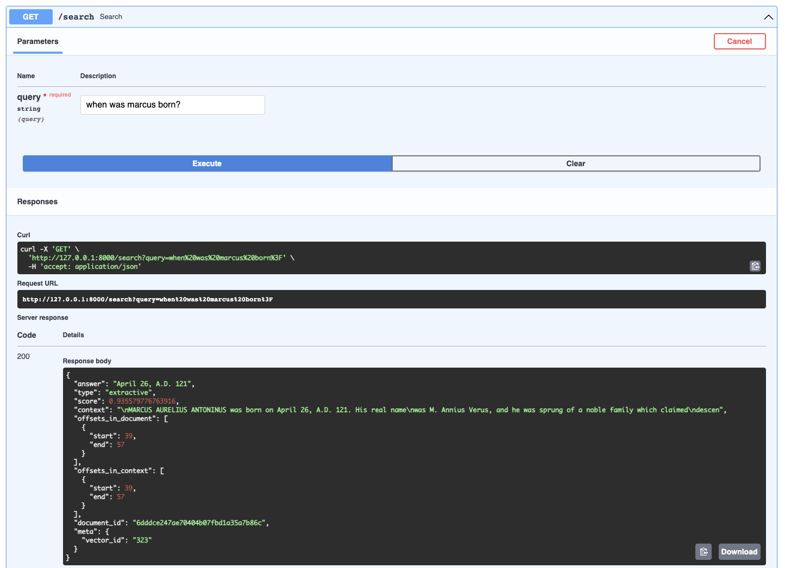

# DSBA 6156: Applied Machine Learning


Shared repository for Applied Machine Learning Group 2 Final Project.

## Installation

- pip

    ```bash
    make pip-install
    ```

## Docker

We have included some helper functions to build and run the docker image for you. Run the following:

```bash
make docker-build
make docker-run
```

Once the service has finished initializing, you can head on over to [127.0.0.1:8000/docs](https://127.0.0.1:8000/docs) to view the interactive Swagger documentation.

## Usage

To start the FastAPI service, run the following from the base directory of the repo:

```bash
make fastapi
```

Once the service has finished initializing, you can head on over to [127.0.0.1:8000/docs](https://127.0.0.1:8000/docs) to view the interactive Swagger documentation.



## License

[MIT](https://choosealicense.com/licenses/mit/)
